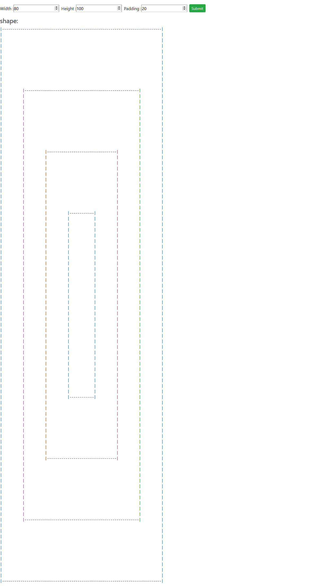

# Infinite recursive shape


Solution for assignment infinite recursive shape. 

## Installation

Use the package manager [NPM](https://www.npmjs.com/) to install Dependency.

```bash
npm install
```

## Testing Steps

Use the below command to start node server.

```bash
npm start
```

After staring the node server, Please visit to `http://localhost:8182` to access the application.

## Note

 - `draw()` and `drawShape()` function is inside `src/draw.js` file. Also check inline comments for implementation logic.
 - `server.js` file has all backend logic like validation of input data, etc.
 - Screeshots for 4 cases are inside `docs` folder.

## Big O of The Solution 

There are 3 possible case 

1. for very large value of N the Time complexity will be big `O (n^2)`
2. for very large value of M the Time complexity will be big `O (m^2)`
3. for very large value of O the Time complexity will be big `O (1)`

Where `N` in `Width`, `M` is `Height` and `O` is `Padding`


## Unit tests

Use the below CMD to run unit test for `draw()` function.

```bash
npm test
```


## Screen Shots for 4 Cases as Below

    


**Sachindra Singh**

* [github/sachindrasingh](https://github.com/sachindrasingh)
* [linkedin/singhsachindra](https://www.linkedin.com/in/singhsachindra/)